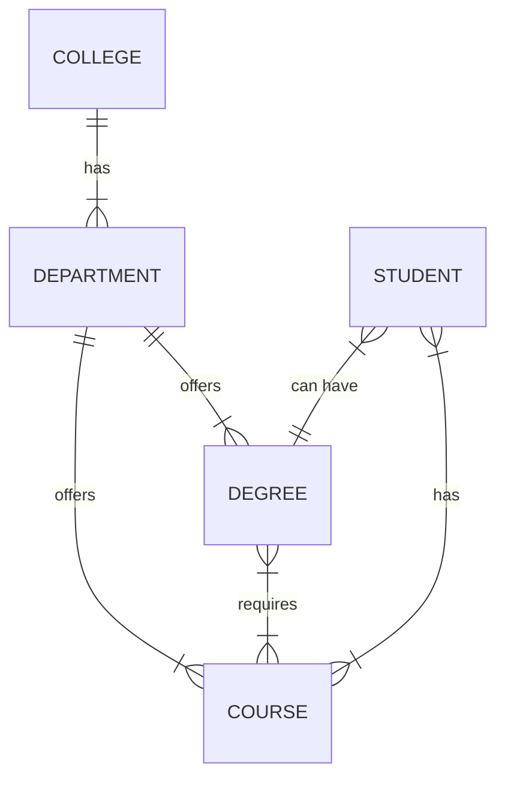
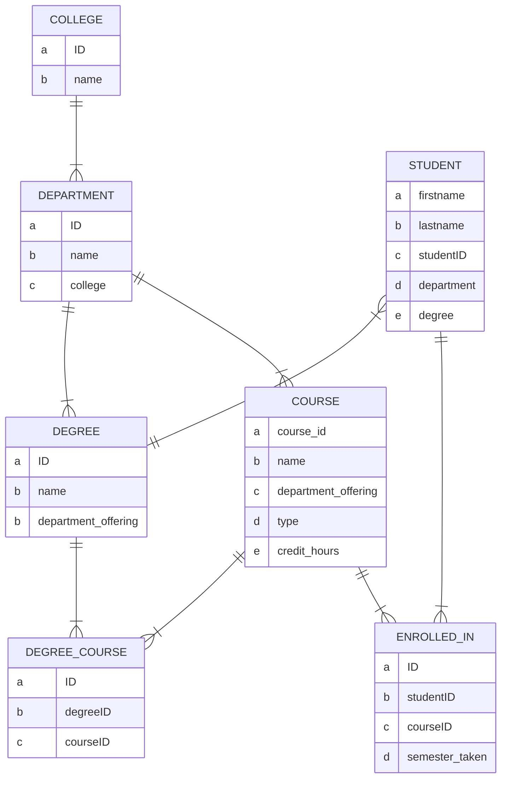
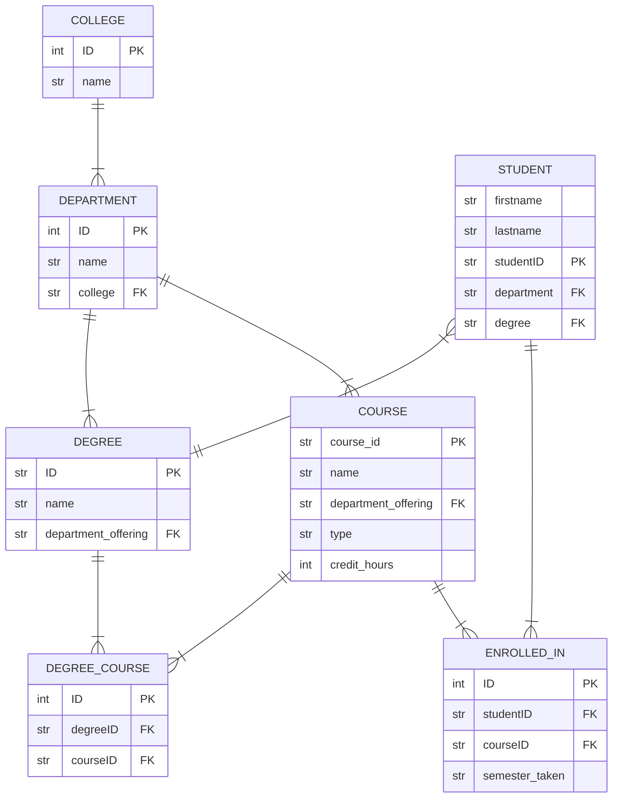

# CIDM6325A_2

# Entity relationship diagrams

## Conceptual
This diagram shows the relationships of colleges, departments, the degrees each department offers, courses the different departments are offering and what courses are required for degree completion, and student information such as the degree they are pursuing and the courses they have taken.

## Logical
This diagram shows a more detailed version of the conceptual diagram. It includes the different attributes for each object and it also breaks down the many-to-many relationships we saw earlier on the conceptual diagram.

## Physical
This diagram shows the data type of each attribute and also indicates which ones are the primary and foreign keys.

